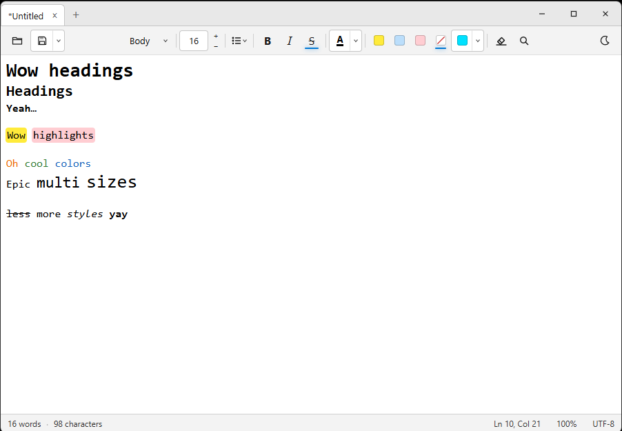
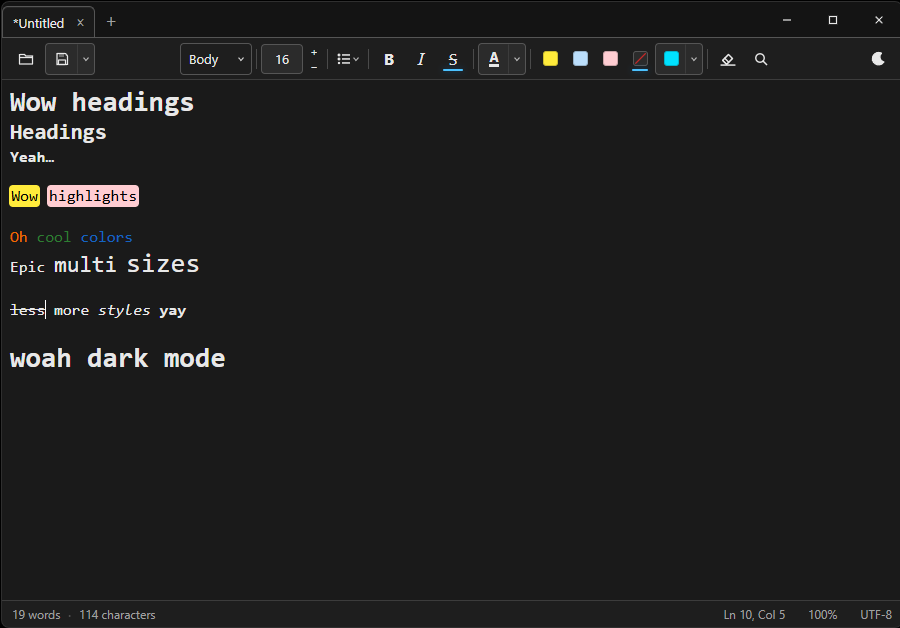
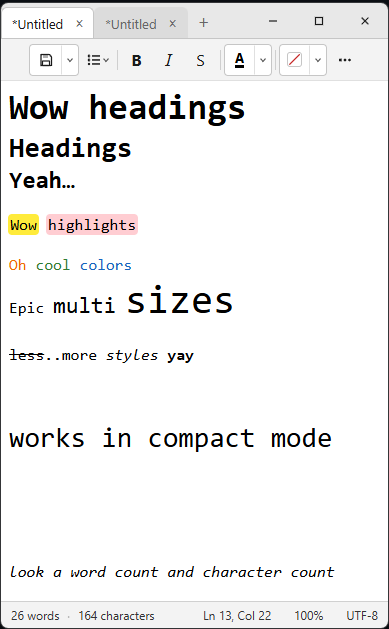

# NoteEasy

A small Windows notepad with tabs and text highlighting. Built with [Tauri 2](https://v2.tauri.app/), React, and [TipTap](https://tiptap.dev/), so it uses WebView2 instead of shipping a whole browser.

I just wanted highlighting in the regular notepad app. So I made my own notepad app quickly. I did use AI to do a lot of the tedious coding and figure out how Tauri actually works because their docs are...lacking. But it's actually quite performant.

## Features

- Multiple tabs with session restore (tabs and formatting come back when you reopen the app)
- Highlight colors (yellow, blue, pink, or pick your own)
- Bold, italic, strikethrough, font color, lists, and paragraph styles
- Find and replace
- Dark mode (remembered between sessions)
- Toolbar that packs into an overflow menu when the window is narrow
- Save as `.nte` (keeps formatting) or plain `.txt`

## Screenshots

Light mode:



Dark mode:



Compact mode (narrow window):



## Download

Latest Windows builds are on the [Releases](https://github.com/BrandonS8/NoteEasy/releases) page:

| File | Notes |
| --- | --- |
| `.msi` | Installer (easiest option) |
| NSIS `.exe` | Alternate installer |
| Portable `.exe` | No install, just run it |

Needs Windows 10/11 and [WebView2](https://developer.microsoft.com/microsoft-edge/webview2/) (already on most PCs).

Windows may show an “Unknown publisher” / SmartScreen warning. The builds are not code-signed. If you downloaded them from this repo’s Releases page, choose More info → Run anyway.

## Develop

You need Node.js 18+, Rust ([rustup](https://rustup.rs/)), and WebView2.

```bash
npm install
npm run tauri dev
```

Optional: put Cargo build output on another drive if C: is full.

```powershell
$env:CARGO_TARGET_DIR = "D:\cargo-target\NoteEasy"
$env:CARGO_HOME = "D:\cargo-home"
```

## Build

```bash
npm run tauri build
```

Installers show up under `release/bundle/` in your Cargo target directory (`src-tauri/target` by default, or whatever you set in `CARGO_TARGET_DIR`).

## License

MIT
